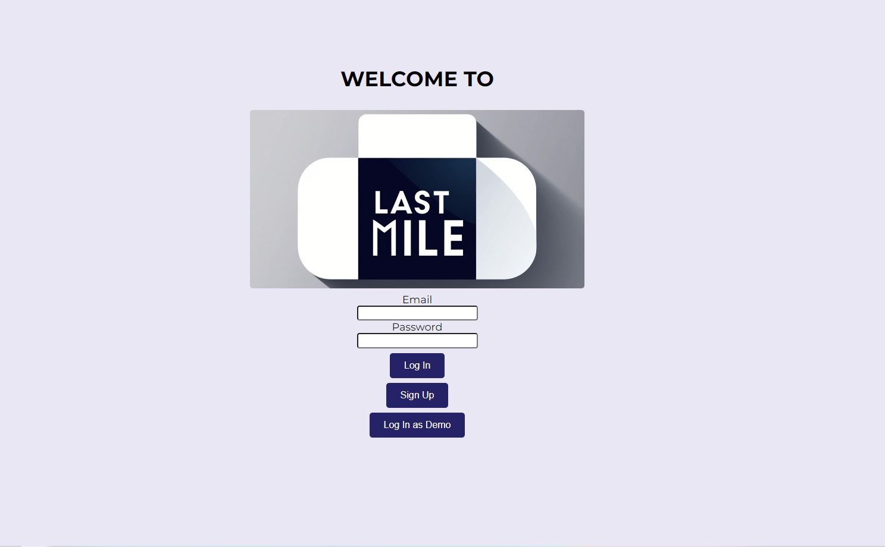
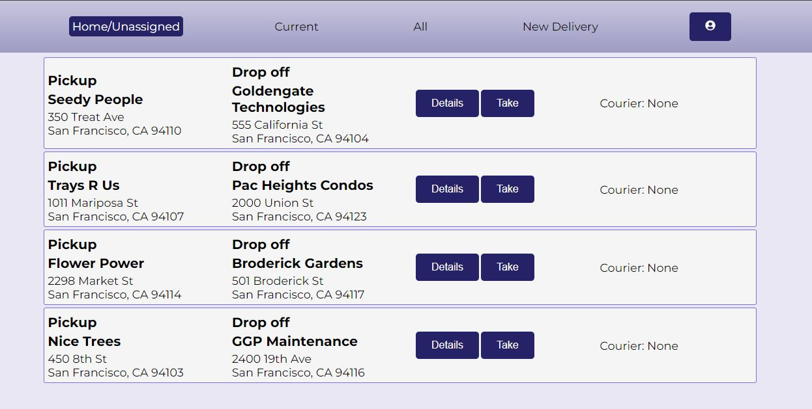
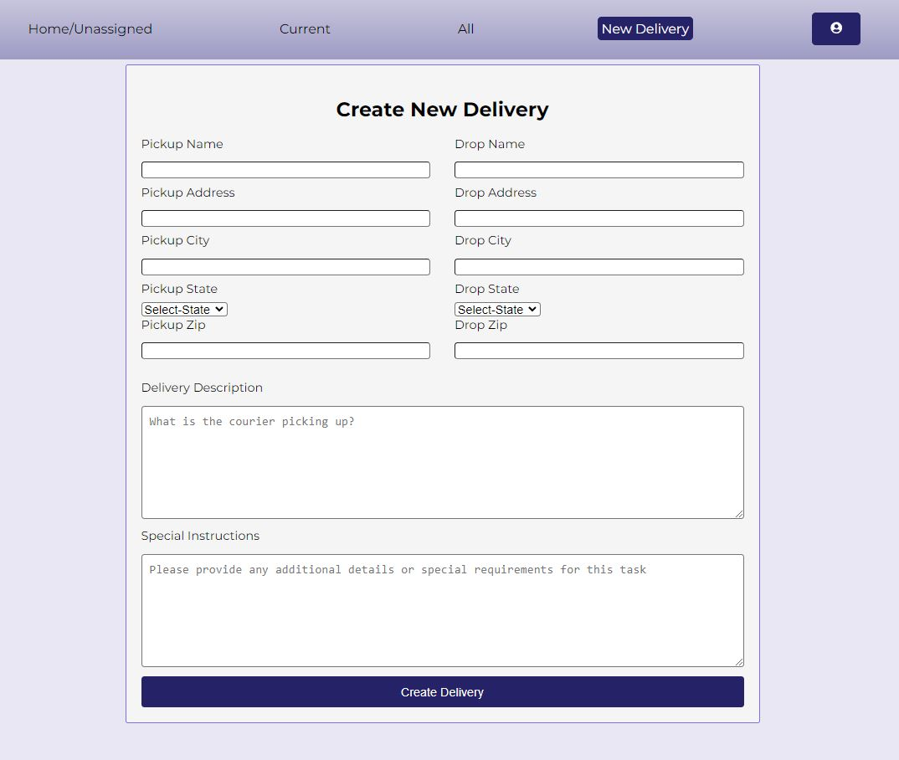
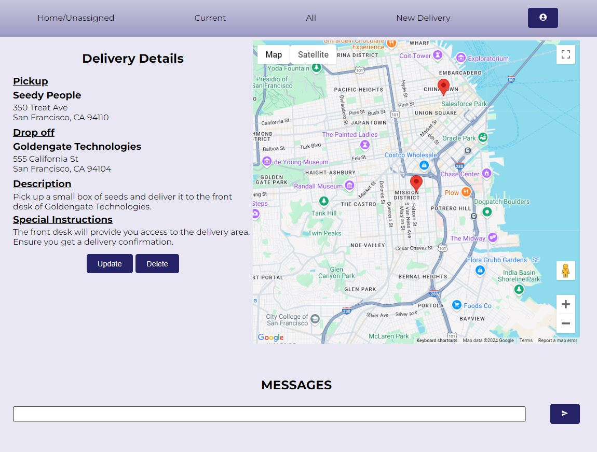

# Welcome to the Last Mile

Last Mile is a lightweight logistics app built to help a company efficiently organize deliveries, work loads for employees across the organization. Users should be able to log in to create, and update any deliveries they see on the board. This allows for the flexibility a small delivery company would need to manage its work flow, in turn increasing the productivity of the entire team.

## Technologies

### Backend
Python:  
SQLAlchemy, Flask   
DataBase:  
PostgreSQL
### Frontend
JavScript:  
Vite-React, Redux(State-Management)  

Google-Maps:  
@react-google-maps/api, react-geocode

